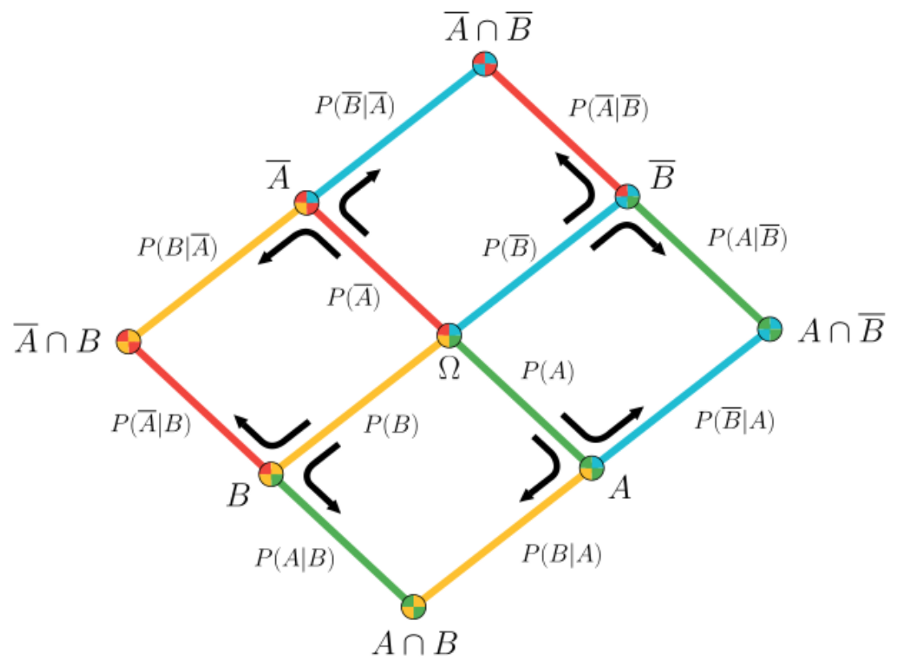

# Most Valuable Reads

2019-05 [Overview of Bayes Logic which has interesting Bayes Diagram](https://medium.com/@aycignl/bayesian-networks-bns-bc53b29c3f66).

2017-12-1 [Description of the blockchain algorithm](https://github.com/ethereum/wiki/wiki/White-Paper)

2017-11-30 [important Javascript Concepts](https://medium.com/javascript-scene/10-interview-questions-every-javascript-developer-should-know-6fa6bdf5ad95)

[see Data data Dichotomy Rethinking The Way We Treat Data And Services](https://www.confluent.io/blog/data-dichotomy-rethinking-the-way-we-treat-data-and-services/)
Interesting view from a number of viewpoints.  Value of database vs api services.  Takes the view to replicate data from master to consumer.

[see Cypress](https://www.cypress.io/)  This is a nice way to develop web application tests.  Rather than using web driver, the test framework runs in the browser itself. One limitiation is that the web application must be able to run in an iframe.

[NPM Dependencies](https://david-dm.org/)
